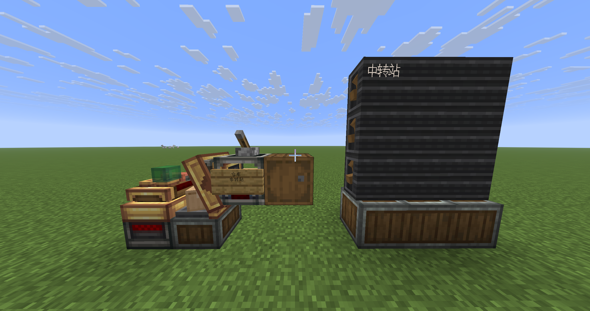
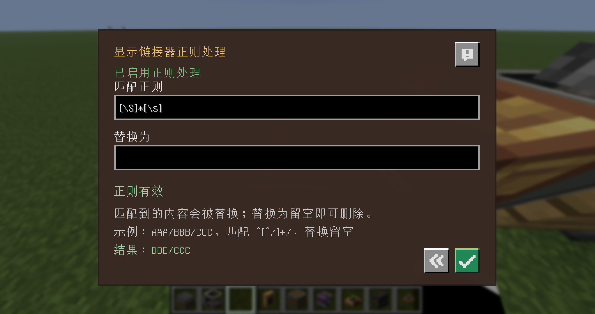

# Create: Display Regex

A tiny Fabric addon for **Create Fly** that post-processes Display Link output with a Java regular expression.
It changes only what is sent to the display target; it does **not** alter package addresses, inventories, or the
underlying source block.

Chinese player guide: [README.zh-CN.md](README.zh-CN.md)

## Baseline

This workspace follows Create Fly's `26.2` branch baseline used during development:

- Minecraft `26.2-rc-2`
- Fabric Loader `0.19.3`
- Fabric API `0.152.0+26.2` (used to register the addon's client language resources)
- Create Fly `6.0.9`, build `1`
- Java `25`
- Gradle `9.4.1`

## Usage

Open a Display Link. A new Create-style configuration icon appears immediately left of the normal confirm button.
It opens a small screen with:

- enable/disable toggle
- **Pattern**
- **Replacement**
- live validation

Example:

```text
input       AAA/BBB/CCC
pattern     ^[^/]+/
replacement <empty>
output      BBB/CCC
```

This runs after the selected Display Source has produced its text, so it changes only what reaches the display target.
It does not alter package addresses, inventories, or the source block.

## Screenshots

### Display result

The Display Link sends the post-processed text to the display board while the source data remains unchanged.



### Regex configuration

The configuration screen provides an enable switch, Pattern and Replacement fields, validation, and a short usage
example. The screenshot uses the Simplified Chinese translation.



## Install and build

A Java 25 JDK is required.

```bash
./gradlew build
```

The installable mod is `build/libs/create-display-regex-0.1.0.jar`; do not install the accompanying
`-sources.jar`. Create Fly is resolved from its published Modrinth Maven coordinate
(`26.2-rc-2-6.0.9-1`).

Required runtime dependencies:

| Dependency | Verified version |
| --- | --- |
| Minecraft | `26.2-rc-2` |
| Fabric Loader | `0.19.3` or newer |
| Fabric API | `0.152.0+26.2` or newer |
| Create Fly | `>=6.0.9-1 <6.1.0-` |

Put the installable JAR in a compatible Fabric instance's `mods` directory. The server must install the mod;
clients that need to configure regex rules should install it too.

The same JAR is intended to cover the Create Fly `6.0.x` line. `6.0.9-1` is the currently tested baseline;
newer `6.0.x` versions should be checked with the static Mixin compatibility script and a smoke test before being
listed as verified. Create Fly `6.1+` is deliberately rejected because this mod targets Create internals.

## Release

Pushing a version tag beginning with `v` runs the release workflow. It builds the project and creates a GitHub
Release containing only the installable JAR. Tags containing a hyphen are marked as pre-releases automatically.

## Development and release

Start a development client with:

```bash
./gradlew runClient
```

Do not manually copy this project's JAR into `run/mods`: Loom loads the project automatically in development.

Run the pure-Java regex test with:

```bash
./scripts/test-regex-processor.sh
```

To release a version, set `mod_version` in `gradle.properties`, commit the change, then push a matching `v` tag.
For example:

```bash
git tag v0.1.0
git push origin v0.1.0
```

GitHub Actions builds the mod and attaches only the installable JAR to the GitHub Release.

The **Static compatibility** workflow runs weekly and on demand. It fetches Create Fly artifacts for a selected
Minecraft release line, checks every Mixin hook used by this mod, and publishes a compatibility report as an Action
artifact. Run the same check locally with `./scripts/check-create-fly-compatibility.sh 26.2`.

## Limitations

- Full Minecraft/Gradle compilation requires Java 25 plus dependency/network access.
- Text components are converted to literals after processing; top-level style is kept, but complex nested component
  styling may be flattened.
- Flap-display regex is applied per section, not across multiple flap sections. This keeps Create's layout stable.
